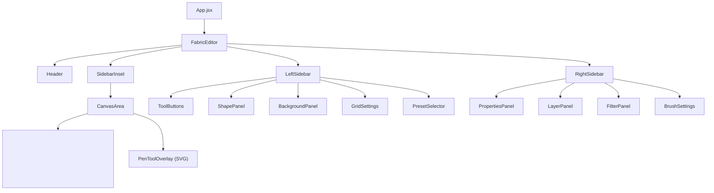

# Architecture Overview

> Last updated: 2026-04-02

This project is a professional-grade, browser-based design editor and whiteboard built with React 19 and Fabric.js 6.

---

## Core Technologies

| Layer              | Technology                                        |
| :----------------- | :------------------------------------------------ |
| **UI Framework**   | React 19 (hooks-based, no class components)       |
| **Build Tool**     | Vite 7                                            |
| **Canvas Engine**  | Fabric.js 6.7.1 — object-based canvas management  |
| **Whiteboard**     | Konva.js 10 + react-konva (secondary module)      |
| **Styling**        | Tailwind CSS 4 + shadcn/ui + Lucide React icons   |
| **Drag & Drop**    | `@dnd-kit/core` + `@dnd-kit/sortable`             |
| **Persistence**    | LocalStorage auto-save via `persistence.js`       |
| **History**        | Custom 50-entry snapshot stack (`historyStore.js`) |

---

## Application Entry Flow

```
main.jsx → App.jsx → FabricEditor (single-page app)
```

- `App.jsx` renders `<FabricEditor />` directly — no routing.
- The Whiteboard module (`src/features/whiteboard/`) exists as a standalone Konva-based canvas but is **not** wired into the main app flow.

---

## Component Hierarchy



---

## Directory Structure

```
src/
├── App.jsx                        # Entry point → FabricEditor
├── main.jsx                       # React root mount
├── index.css                      # Tailwind global styles
├── components/ui/                 # shadcn UI primitives (Button, Card, Sidebar, etc.)
├── lib/                           # Shared utilities (cn helper)
└── features/
    ├── editor/                    # ★ PRIMARY EDITOR
    │   ├── components/
    │   │   ├── FabricEditor/index.jsx   # Main component (~1800 LOC)
    │   │   ├── Canvas/index.jsx         # CanvasArea (canvas wrapper + cursor)
    │   │   ├── sidebar/
    │   │   │   ├── Header/              # Top bar: name, zoom, undo/redo, export
    │   │   │   ├── LeftSidebar/         # Tool palette, shapes, backgrounds, presets
    │   │   │   └── RightSidebar/        # Properties, layers, filters, brush settings
    │   │   ├── DrawingToolsPanel/       # Brush tool sub-panel
    │   │   ├── filters/                 # Image filter controls
    │   │   └── layer-item/              # Single layer row component
    │   ├── hooks/
    │   │   ├── useHistory.js            # Undo/redo hook wrapping historyStore
    │   │   └── useFabricDrawing.js      # Drawing mode utilities
    │   ├── lib/
    │   │   ├── canvasUtils.js           # Shape factories, grid, backgrounds, anchors, connectors
    │   │   ├── editorState.js           # Element counter recovery from state
    │   │   ├── historyStore.js          # 50-entry undo/redo ring buffer
    │   │   ├── persistence.js           # LocalStorage save/load/clear
    │   │   ├── layerOrder.js            # Layer reorder (move up/down)
    │   │   ├── shapeUtils.js            # Shape-specific helpers
    │   │   └── filterUtils.js           # Image filter helpers
    │   ├── constants/
    │   │   ├── canvasPresets.js          # Canvas size presets (Instagram, A4, etc.)
    │   │   └── filterIndices.js         # Filter type indices
    │   └── tools/
    │       └── pen/                     # Pen Tool subsystem
    │           ├── usePenTool.js         # Core hook: draw/edit modes, handlers
    │           ├── usePathRenderer.js    # buildSVGPath() — AnchorPoint[] → SVG d string
    │           ├── PenToolOverlay.jsx    # SVG overlay for points/handles/preview
    │           └── types.js             # AnchorPoint, VectorPath, PenToolState types
    └── whiteboard/                # Secondary whiteboard (standalone)
        ├── Whiteboard.jsx
        ├── WhiteboardExample.jsx
        ├── components/
        └── hooks/
```

---

## Key Components

### FabricEditor (`src/features/editor/components/FabricEditor/index.jsx`)

The central orchestration component (~1800 lines). Manages:

| Responsibility          | Description                                                         |
| :---------------------- | :------------------------------------------------------------------ |
| **Canvas lifecycle**    | Creates `FabricCanvas`, initializes brush, loads persisted state     |
| **Tool switching**      | `currentTool` state → configures `isDrawingMode`, event handlers    |
| **Event routing**       | Mouse down/move/up/dblclick dispatched per active tool              |
| **Shape creation**      | Interactive click-drag shape creation via `createInteractiveShape`  |
| **Pen tool integration**| Delegates to `usePenTool` hook when `currentTool === 'pen'`        |
| **Connector lines**     | Anchor-snapped lines that update on object movement                 |
| **State sync**          | `syncElements()` keeps sidebar layer list in sync with canvas       |
| **Persistence**         | `safeSaveState()` → history stack + LocalStorage                    |
| **Keyboard shortcuts**  | Global keydown handler for all tools                                |

### CanvasArea (`src/features/editor/components/Canvas/index.jsx`)

Simple wrapper rendering:
- A `<main>` container with gradient background and overflow scrolling
- A `<Card>` sizing the canvas to `canvasSize`
- A `<canvas>` element for Fabric.js
- Children slot for the `PenToolOverlay`

### Pen Tool (`src/features/editor/tools/pen/`)

A complete Figma-style vector pen tool:

| File                  | Purpose                                                     |
| :-------------------- | :---------------------------------------------------------- |
| `usePenTool.js`       | Main hook: draw mode, edit mode, handle drag, node ops      |
| `usePathRenderer.js`  | Converts `AnchorPoint[]` → SVG path `d` attribute string   |
| `PenToolOverlay.jsx`  | SVG overlay for anchor squares, handle circles, preview     |
| `types.js`            | `AnchorPoint`, `VectorPath`, `PenToolState` type definitions|

---

## Data Flow

### State Management

```
User interaction
    → Mouse/keyboard event
    → Handler updates canvas objects (Fabric.js internal state)
    → syncElements() → React state (elements[], selectedIds[])
    → safeSaveState() → historyStore (undo stack) + localStorage
```

### Undo/Redo Flow

```
safeSaveState()
    → canvas.toObject(['data', 'id', 'name'])
    → historyStore.saveState(JSON)    # push to 50-entry ring buffer
    → persistence.persistCanvasState() # write to localStorage

handleUndo()
    → historyStore.undo()             # step back, return snapshot
    → canvas.loadFromJSON(snapshot)   # restore entire canvas

handleRedo()
    → historyStore.redo()             # step forward, return snapshot
    → canvas.loadFromJSON(snapshot)   # restore entire canvas
```

### Pen Tool Path Lifecycle

```
1. User clicks with pen tool → usePenTool places AnchorPoint
2. usePenTool maintains VectorPath in React state
3. PenToolOverlay renders SVG preview (points, handles, path)
4. On path completion (Enter/Escape/close):
   → handlePenPathComplete(vectorPath)
   → buildSVGPath() → SVG d string
   → new fabric.Path(d) → added to canvas
   → Data stored: path.data = { id, type: 'path', points, closed }
5. Double-click existing path → enterEditMode → restore AnchorPoints
```

---

## Canvas Presets

| Preset Name        | Width × Height     |
| :----------------- | :----------------- |
| Custom             | 1080 × 780        |
| Instagram Post     | 1080 × 1080       |
| Instagram Story    | 1080 × 1920       |
| Facebook Post      | 1200 × 630        |
| Twitter Post       | 1200 × 675        |
| YouTube Thumbnail  | 1280 × 720        |
| A4 Portrait        | 2480 × 3508       |
| A4 Landscape       | 3508 × 2480       |

Presets auto-scale to fit 70% of the viewport on selection.

---

## Design System

- **Theme:** Dark modern UI using shadcn/ui components
- **Icons:** Lucide React
- **Layout:** `SidebarProvider` + `SidebarInset` for responsive sidebar management
- **Canvas Container:** Rounded card with radial gradient background
- **Colors:** Driven by Tailwind CSS 4 design tokens
